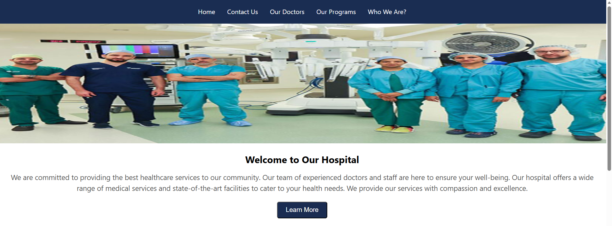
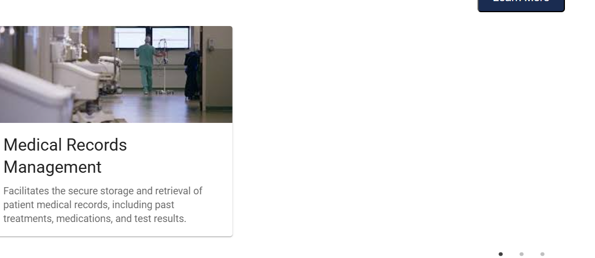
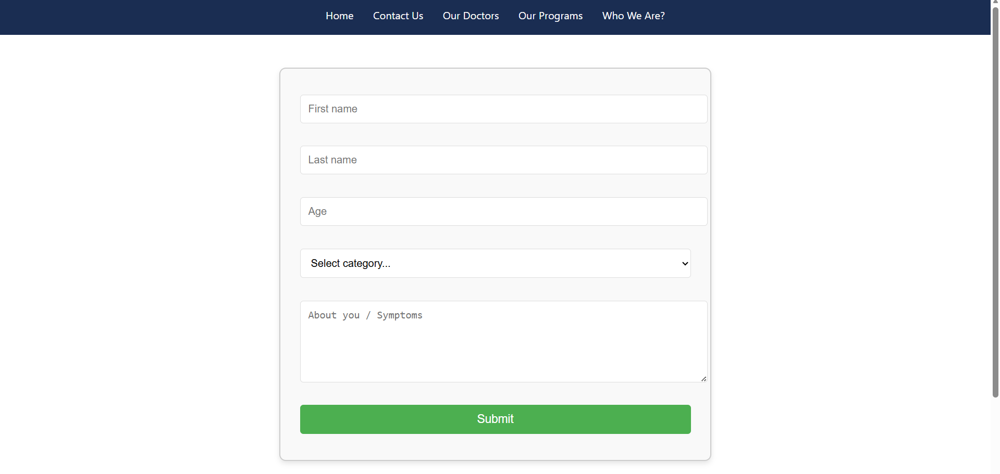
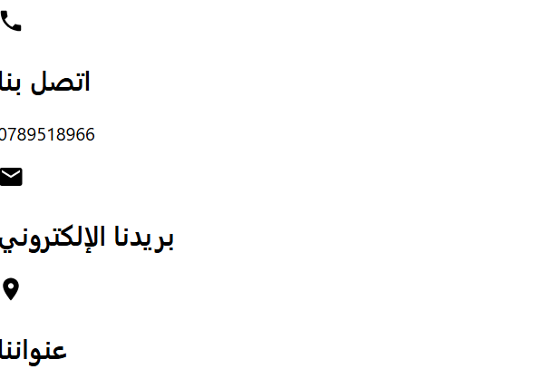
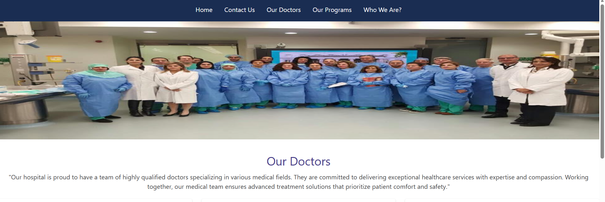
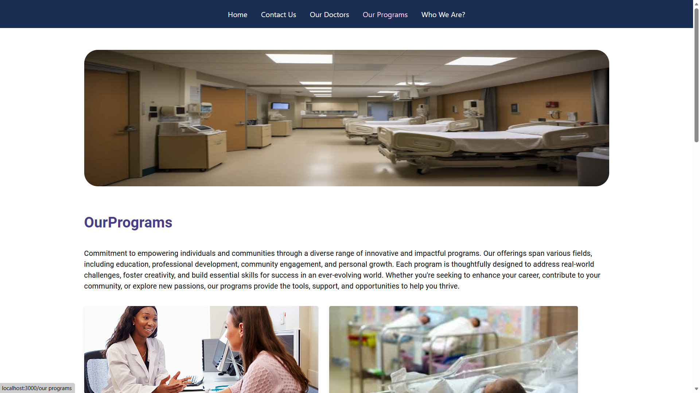
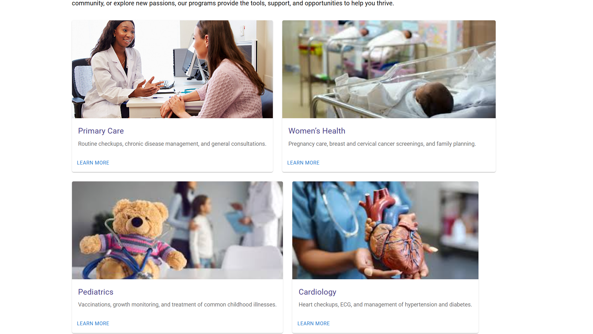
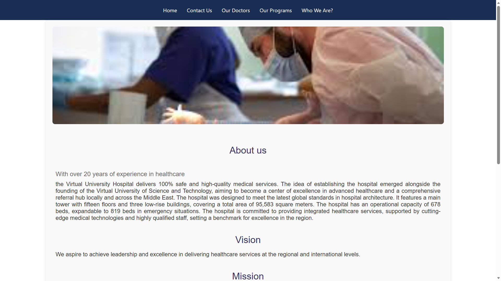
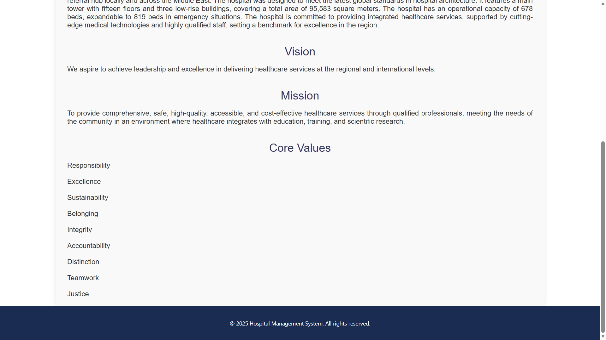

# Hospital React Project

## Introduction
This project is an interactive website for a hospital, aimed at facilitating access to information and services provided to patients and visitors.

---

## Website Sections

### Home
Main page providing an overview of the hospital and its services.

### Contact Us
Page for contacting the hospital.

### Our Doctors
Showcase of hospital doctors and their expertise.

### Our Programs
Hospital programs and services.

### Who Are We
Information about the hospital and its team.

---

## Technologies Used
- React.js for building interactive interfaces
- CSS and Bootstrap for styling
- API for dynamic data retrieval

---

## Notes
- Internal navigation links can be added for easier section access.
- Design can be improved with icons and graphics.
- Regular updates to images are recommended to reflect current services.

---

## Contact Information
For inquiries, please contact us at: info@hospital.com or call: 123-456-7890.

---

**Note:** Feel free to modify or add any sections as needed.